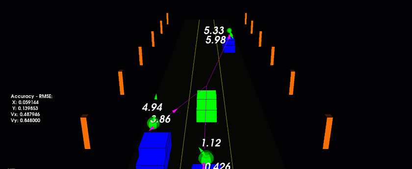
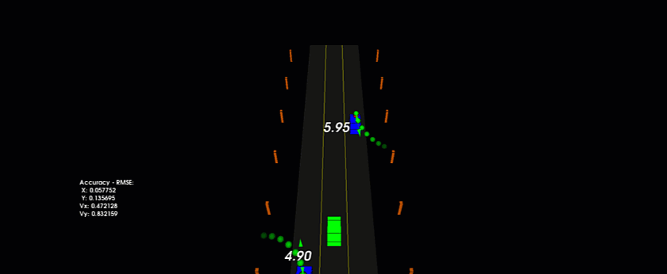
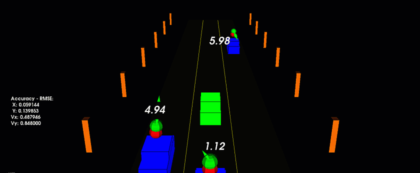
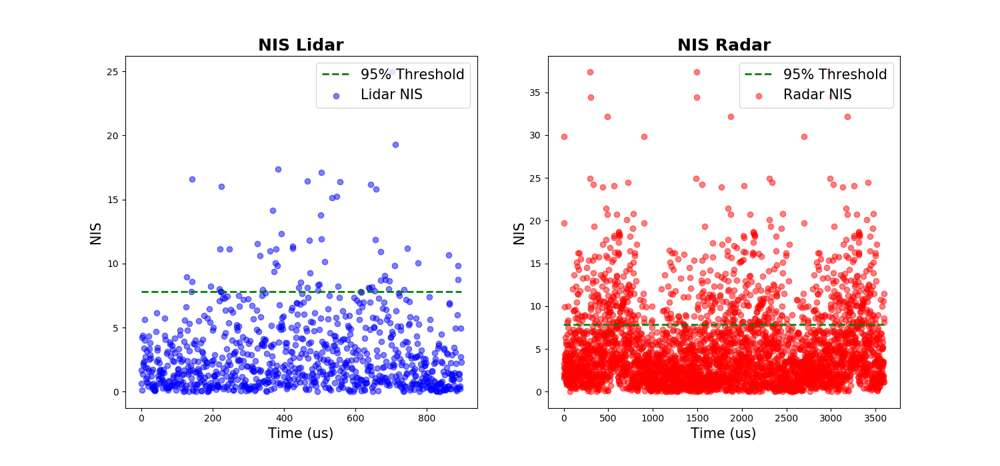

# Unscented Kalman Filter
This project implements an Unscented Kalman Filter to estimate the state of multiple cars on a highway environment using noisy lidar and sensor data. Data is fused to estimate the state of each car, represented by their position and velocity in the x and y directions. A UKF object, which implments the Constant Turn Rate Constant Velocity (CTRV) motion model, is updated at each time step to estimate the state of each car. Accuracy is evaluated by comparing the state of each car to the ground truth using Root Mean Square Error (RMSE).




## Dependencies for Running Locally
The following dependencies are required to run the program locally. 
* cmake >= 3.17
  * All OSes: [click here for installation instructions](https://cmake.org/install/)
* make >= 4.3 (Linux, Mac)
  * Linux: make is installed by default on most Linux distros
  * Mac: [install Xcode command line tools to get make](https://developer.apple.com/xcode/features/)
* PCL >= 1.12
  * Installation instructions can be found [here](https://formulae.brew.sh/formula/pcl)
* Eigen >= 3.3
  * Installation instructions can be found [here](https://formulae.brew.sh/formula/eigen#default)
* gcc/g++ >= 5.4
  * Linux: gcc / g++ is installed by default on most Linux distros
  * Mac: same deal as make - [install Xcode command line tools](https://developer.apple.com/xcode/features/)
* Sensor Data
  * Sensor data is not included in this repository. You will need to download the data and place it in the `./src/sensor/data` directory. The data can found [here](https://github.com/udacity/SFND_Unscented_Kalman_Filter/tree/master/src/sensors/data/pcd).
## Build Instructions

1. Clone the repository and navigate to the downloaded folder.
```
git clone https://github.com/justinbellucci/Uncented-Kalman-Filter.git  

cd Uncented-Kalman-Filter
```

2. Make a build directory in the top level directory:
```
mkdir build && cd build
```
4. Compile 
  ```
  cmake .. 
  make
  ```
5. Run the program
  ```
  ./ukf_highway
  ```

## UKF Architecture
The UKF is implemented as a class containing the following methods:

```void ProcessMeasurement(MeasurementPackage &meas_package);```   
  * Initializes the state and covariance matrices according to the CTRV motion model. Radar and Lidar matrices are initialized separatly as the CTRV motion model is defines Radar as non-linear and Lidar as linear.   

```void Prediction(double &delta_t);```  
  * Sigma points are generated and predicted according to the CTRV model. The predicted sigma points are used to predict the state and covariance matrices.   

```void UpdateLidar(MeasurementPackage &meas_package);```   
  * Updates the state and covariance matrices using a lidar measurement.  

```void UpdateRadar(MeasurementPackage &meas_package);```    
  * Updates the state and covariance matrices using a radar measurement assuming the CTRV motion model. 

 ## Simulation
 The simulation can be manipulated by changing parameters in the `highway.h` file. 
 
 ---
 The image below shows the predicted state of each car 2 seconds into the future illustrated by the green spheres. 

```
double projectedTime = 2;
int projectedSteps = 6;
```


---
Radar is not visualized in this image. The red spheres reprent the Lidar data and the green spheres represent the predicted state of each car.
```
bool visualize_radar = false;
``` 



---
The radar is visulized by the purple arrows.
```
bool visualize_radar = true;
```


## Consistancy Check 
Normalization Innovation Squared (NIS) is calculated for each sensor and plotted following a chi-squared distribution at each UKF update time step. NIS is the difference between the predicted measurement and the actual measurment normalized in relation to the covariance matrix `S`. The `./jupyer/NIS.ipynb` notebook contains the code for plotting the NIS values. In 5% of all cases the NIS is higher then 7.815 as plotted by the green dashed line below. In this case the CTRV motion model underestimates the uncertianty in the system. Noise parameters can be adjusted to reduce the uncertainty in the system. 



## Code Style

This project folows [Google's C++ style guide](https://google.github.io/styleguide/cppguide.html).
